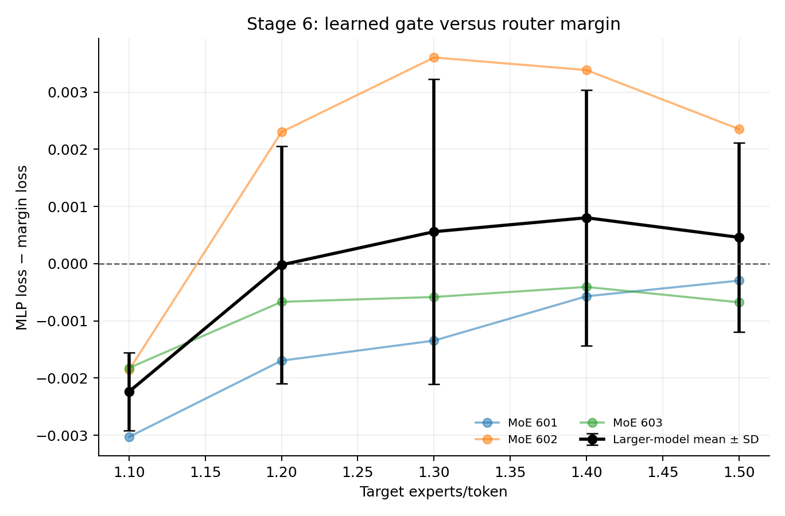
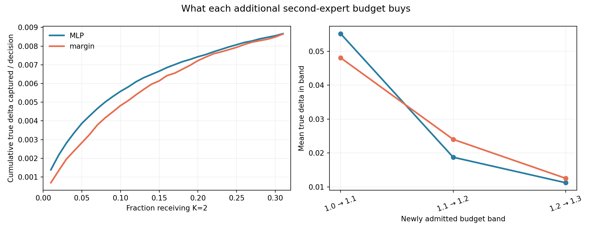

# MoEjev

**Can a model cheaply identify the small subset of tokens where additional
expert compute is actually worth spending?**

MoEjev is a small, local research project about that question. It compares a
learned compute gate with a simple router-margin rule on the *same* trained
Mixture-of-Experts (MoE) language models. The goal is to see whether we can
identify, before running it, when a second expert is actually worth the extra
compute.

## Project idea

In an MoE, a router chooses which expert networks process each token. Our
baseline chooses its top two experts. At inference time, we can run just the
first expert for some token-layer decisions and both experts for others. At
**1.10 experts per decision**, roughly 10% of those decisions get the second
expert; at **2.00**, all of them do. The question is which 10% deserve it.

We measure model quality against expert executions, holding the base model
fixed within each comparison. Fewer expert executions are useful only if the
loss increase is small enough to make the trade worthwhile.

## Why I started this

This was inspired by Jev and the broader idea of calibrated decision models:
confidence should be useful for making decisions, not merely look convincing.
Router probabilities seemed like a natural place to test that idea. But router
uncertainty and the *value of another expert* may be different things.

**This project does not implement or reproduce TypeSafe Jev or RLCD.** Their
exact method is not public. The calibration, routing rules, and compute gate
here are independent implementations of known techniques.

## Current result

- **Better confidence was not better compute allocation.** Post-hoc temperature
  scaling improved hard-label ECE from 0.1751 to 0.0303 on the first model,
  but the matched uncalibrated margin rule had slightly lower validation loss
  (2.0407 vs 2.0411 at about 1.30 experts per decision).
- **The learned gate helped most when compute was scarce.** Across five fresh
  small MoEs, its mean loss advantage over margin was 0.0027 at about 1.10
  experts per decision; four of five base models favored it. The confidence
  interval included zero, so this is a modest directional replication.
- **The larger model kept only the tight-budget effect.** Across three
  independently trained 35.62M-parameter, eight-expert MoEs, all three favored
  the learned gate near 1.10 (mean MLP-minus-margin loss −0.00224). The methods
  were effectively tied near 1.20; margin won on average near 1.30.

The Stage 6 plot uses the nearest *measured* operating points at matched expert
budgets. The three thin lines are individual base models; the black line
summarizes them. Below zero means the learned gate has lower loss.



[Stage 6 matched-compute data](results/stage6-larger-moe-20260922-234631/aggregate/matched_compute.csv)

## Experiment setup

The models are byte-level Transformers trained on a small WikiText-2 slice. The
first has two four-expert MoE layers; the later scale test has three eight-expert
MoE layers and 35.62 million parameters. Both use ordinary learned Top-2
token routing. Comparisons on a given checkpoint change only the rule for
running one or two of the router's chosen experts.

For analysis, we ask what would happen if one decision used only its first
expert while the otherwise unchanged model used Top-2. We call the difference

```text
delta_loss = loss with one expert − loss with two experts
```

A positive value means the second expert helped that decision. These isolated,
target-informed measurements train and diagnose the gate; the gate never sees
the true delta at inference time. It sees the pre-MoE hidden state, router
probabilities, their margin and entropy, and layer identity. The comparison
rule uses only the **router margin**: a small gap between the top two expert
probabilities triggers a second expert. Gate training, threshold calibration,
and final validation use separate data regions. Both adaptive methods choose
only between K=1 and K=2, even when eight experts are available.

## What this does not show

- A result for all MoEs, datasets, model sizes, or routing methods. We tested
  small byte models on one text dataset and only a few independent checkpoints.
- A large or uniform advantage. The effect is small, weakens with more expert
  compute, and varies by base model and MoE layer.
- A wall-clock speedup. The current dynamic gate ran at about **0.93×** the
  fixed Top-2 throughput in Stage 6 despite fewer expert executions.
- A deployable oracle. True delta and all-expert counterfactual losses require
  validation targets; they are used for training and analysis, never as inputs
  to the deployed routing decision.

The Stage 6.5 mechanism analysis reuses Stage 6 validation decisions. It helps
explain that experiment but is not a new independent test set.

## Stage 6.5 diagnostic

At about 1.10 experts per decision, MLP-only K=2 choices had mean measured
second-expert benefit 0.0399, versus 0.0292 for margin-only choices. Margin
admitted better new choices as the budget grew, especially on base seed 602.
These are isolated counterfactual values, not the joint online model loss.



[Stage 6.5 capture data](results/stage6_5-mechanism-20260923-140045/capture_curve.csv)
· [High-value decision recall](results/stage6_5-mechanism-20260923-140045/plots/high_value_recall.png)

## Reproduction

The project ran locally on an NVIDIA RTX 3060 Laptop GPU with 6 GB VRAM. It
does not use pretrained models or distributed training. You need Python,
CUDA-enabled PyTorch appropriate for your machine, and the packages in
`requirements.txt`. Check that the hardware script reports CUDA available
before a full run. WikiText-2 is downloaded on first use.

Start with the smoke configuration, which only checks that the pipeline runs:

```powershell
python -m venv .venv
.venv\Scripts\Activate.ps1
pip install -r requirements.txt
python scripts/check_hardware.py --output results/hardware.json
python -m unittest discover -s tests -v
python training/train.py --config configs/smoke.yaml
```

The main Stage 5 and Stage 6 replications each train their own base models;
they can run independently. They take substantially longer than the smoke
check. To reproduce the larger-model result and then analyze it:

```powershell
python evaluation/stage6_larger_moe.py --config configs/stage6_larger_moe.yaml
```

Stage 6 prints its result directory. Stage 6.5 reads that directory; replace
`YOUR-RUN` with its timestamp:

```powershell
python -m evaluation.stage6_5_mechanism --stage6-dir results/stage6-larger-moe-YOUR-RUN
```

For Stage 1–5 commands and the paths that need updating in historical configs,
see [REPRODUCING.md](REPRODUCING.md). The reports and lightweight results can
be read without training; checkpoints and feature caches are excluded from Git.

## Repository structure

| Path | Purpose |
|---|---|
| `configs/` | Model, training, evaluation, and replication settings |
| `data/` | Byte-level WikiText-2 preparation; downloaded cache stays local |
| `moe/` | Transformer, experts, router, and compute gate |
| `training/` | Local trainer and checkpointing |
| `evaluation/` | Oracle interventions, calibration, benchmarks, and Stage 6.5 analysis |
| `results/` | Lightweight saved metrics and plots; large run artifacts remain ignored |
| `scripts/`, `tests/` | Hardware check and focused correctness tests |

## Experiment history

- [Stage 1](STAGE1_REPORT.md): small baseline MoE and local hardware check.
- [Stage 2](STAGE2_REPORT.md): all-expert oracle analysis and routing behavior.
- [Stage 3](STAGE3_REPORT.md): calibrated probabilities and adaptive K controls.
- [Stage 4](STAGE4_REPORT.md): learned compute gate on a frozen checkpoint.
- [Stage 5](STAGE5_REPORT.md): five independent base-model replications.
- [Stage 6](STAGE6_REPORT.md): larger 35.62M-parameter, eight-expert replication.
- [Stage 6.5](STAGE6_5_REPORT.md): high-value decisions, layers, and budget
  exhaustion on the Stage 6 models.

## Next questions

Does the low-budget effect persist on other data and model sizes? Can expert
dispatch be made fast enough to turn fewer executions into lower latency? And
does the same decision problem appear when allocating depth, rather than only
the number of experts? Those are open questions; this repository reports the
experiments completed so far.
