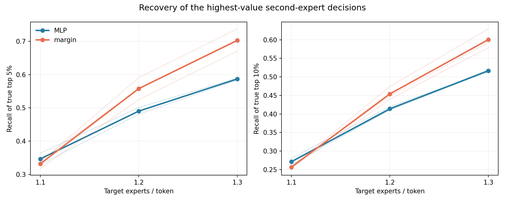
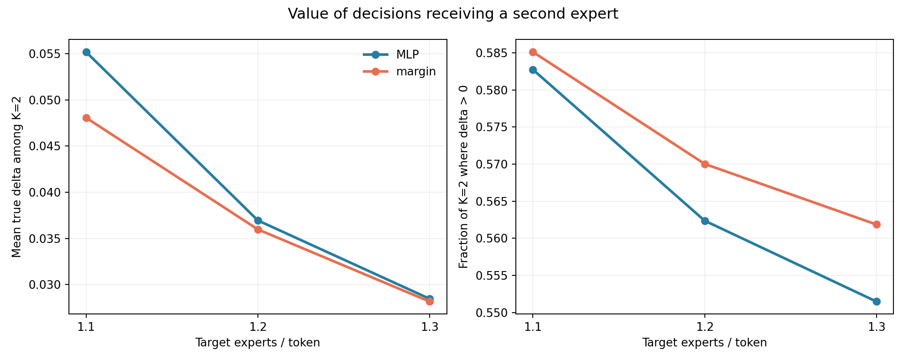
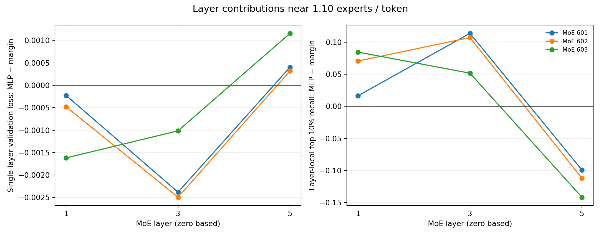
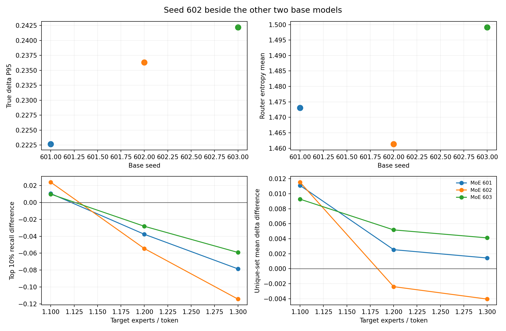

# Stage 6.5 — why the learned gate helps at a small compute budget

This is a diagnostic analysis of the completed Stage 6 experiment. It uses the
same three frozen 35.62M-parameter MoEs (seeds 601, 602, 603), their nine saved
MLP gate checkpoints (seeds 11, 22, 33 for each MoE), and the original final
validation set. No model or gate was retrained, and no threshold was chosen from
these diagnostics. The focus is 1.10, 1.20, and 1.30 experts per token.

## Answer

At approximately **1.10 experts/token**, the MLP spends its scarce second-expert
budget on decisions with larger *measured benefit*. Its K=2 selections have mean
true `delta_loss` **0.0552**, versus **0.0481** for the router-margin heuristic.
Among choices unique to one method, MLP-only decisions average **0.0399** and
margin-only decisions **0.0292**. The MLP also recovers slightly more of the
highest-value decisions. These observations explain the direction of the Stage 6
online result, where mean MLP-minus-margin validation loss was **−0.00224** and
all three base MoEs won at this budget.

The effect is budget dependent. For the *next* approximately 10% of decisions
admitted from 1.10 to 1.20, margin's mean true benefit is **0.0240** versus
**0.0187** for the MLP. From 1.20 to 1.30 the values are **0.0125** versus
**0.0112**. The MLP's cumulative isolated benefit advantage consequently
shrinks from **0.000743** to **0.000207** to **0.000064** per token-layer decision.
At 1.30, the Stage 6 *online* comparison favors margin on average, driven by
base seed 602.

The global rank correlations are weak for both methods. This is evidence for a
limited low-budget selection advantage, not evidence that the MLP reliably
predicts each decision's loss difference or that the same mechanism will work
for adaptive depth.

## What was measured

There are **76,800 token-layer decisions per base MoE**: 25,600 validation byte
positions × three MoE layers. For each decision, the previously saved Stage 6
oracle target is

```text
delta_loss = loss if this token uses Top-1 − loss under normal Top-2
```

The Top-1 term is an isolated, unit-weight intervention at one token in one
layer, with the rest of that evaluation at the original Top-2 baseline. Positive
delta means the second expert helps. The cached hidden states and router values
also come from the original fixed-Top-2 pass. The saved Stage 6 calibration
thresholds were applied unchanged to those cached values. Margin selects K=2
for **smaller** `top1_probability − top2_probability`; the MLP selects K=2 for
larger predicted delta.

“Top 5/10/20%” means ranking true delta across all 76,800 decisions *within
one base MoE*. Recall@10%, for example, is the fraction of the true top decile
that the method routes to K=2. `Precision top 10%` is the fraction of its K=2
choices belonging to that true top decile. `Precision positive` is the fraction
of its K=2 choices whose true delta is greater than zero. The tables average
three gate runs within each base seed, then show descriptive means across the
three base MoEs. Gate seeds are nested runs, not independent base models.

Cached K=2 fractions differ from the original online Stage 6 fractions by at
most **0.0104**, because earlier adaptive decisions can change later hidden
states. Thus cached selection statistics explain a fixed-Top-2-context
counterfactual; they do not exactly reproduce the joint online policies.

## High-value token recovery

| Budget | Method | K=2 fraction | Recall top 5% | Recall top 10% | Recall top 20% | Precision top 10% | Precision positive | Mean selected delta | Median selected delta |
|---:|---|---:|---:|---:|---:|---:|---:|---:|
| 1.10 | MLP | 0.1006 | 0.3467 | 0.2712 | 0.1988 | 0.2695 | 0.5828 | 0.0552 | 0.0223 |
| 1.10 | Margin | 0.1002 | 0.3319 | 0.2564 | 0.1835 | 0.2560 | 0.5851 | 0.0481 | 0.0111 |
| 1.20 | MLP | 0.2016 | 0.4903 | 0.4139 | 0.3305 | 0.2054 | 0.5624 | 0.0370 | 0.0096 |
| 1.20 | Margin | 0.2012 | 0.5578 | 0.4540 | 0.3424 | 0.2256 | 0.5700 | 0.0360 | 0.0069 |
| 1.30 | MLP | 0.3008 | 0.5869 | 0.5163 | 0.4346 | 0.1716 | 0.5515 | 0.0285 | 0.0054 |
| 1.30 | Margin | 0.3017 | 0.7027 | 0.6003 | 0.4766 | 0.1990 | 0.5619 | 0.0282 | 0.0046 |

At 1.10 the MLP's benefit is **not** a higher fraction of positive-delta
choices: its precision positive is slightly lower. It captures *larger positive
benefits on average*, despite also making many unhelpful choices. By 1.20,
margin recovers more members of the true top 5% and top 10%; the two methods'
mean selected deltas become close.



## Which decisions differ at 1.10?

The four sets below partition the same 76,800 decisions. Counts and delta
statistics are mean values across the nine base/gate pairs; the underlying
per-model values are in `selected_sets.csv`.

| Selected by | Mean count | Mean true delta | Median | P90 | Fraction where K=2 helps |
|---|---:|---:|---:|---:|---:|
| Both | 2,458 | 0.0882 | 0.0458 | 0.4984 | 0.6099 |
| MLP only | 5,270 | **0.0399** | **0.0154** | 0.2872 | 0.5702 |
| Margin only | 5,235 | 0.0292 | 0.0044 | 0.2820 | 0.5735 |
| Neither | 63,838 | 0.0045 | 0.0002 | 0.1056 | 0.5148 |

The MLP-only advantage is present for each base MoE: mean delta is 0.0398 vs
0.0287 for seed 601, 0.0394 vs 0.0279 for seed 602, and 0.0404 vs 0.0311
for seed 603. Roughly two thirds of each method's K=2 decisions are unique to
that method; the shared set has the highest mean value. The unique-set gap is
the most direct evidence for how the MLP uses the first 10% budget better.



## Layer location

For a stronger check, we evaluated each frozen MoE with **only one specified
MoE layer adaptive** at the 1.10 cached threshold and the other two MoE layers
fixed Top-2. The table's loss differences are measured validation losses under
this single-layer intervention, averaged over gate seeds. Negative means the
MLP policy is better for that layer. Layer IDs are zero based.

| Base seed | Layer 1 | Layer 3 | Layer 5 |
|---:|---:|---:|---:|
| 601 | −0.00023 | **−0.00238** | +0.00040 |
| 602 | −0.00048 | **−0.00250** | +0.00032 |
| 603 | **−0.00162** | −0.00102 | +0.00116 |
| Mean | −0.00078 | **−0.00196** | +0.00063 |

Layer 3 supplies the largest gain on seeds 601 and 602. On seed 603, layer 1
supplies the largest gain. Layer 5 favors margin on all three models, partially
offsetting the other layers. This is a consistent layer pattern, not a gain
uniformly spread across the network. The actual simultaneous three-layer loss
differences cannot be obtained by adding these single-layer effects.

The layer-local top-decile recall and K=2 allocation help interpret the result:

| Layer | MLP / margin top-decile recall | MLP / margin K=2 fraction | Mean single-layer loss difference |
|---:|---:|---:|---:|
| 1 | 0.2296 / 0.1724 | 0.0975 / 0.0653 | −0.00078 |
| 3 | 0.3462 / 0.2553 | 0.1195 / 0.0871 | −0.00196 |
| 5 | 0.2298 / 0.3473 | 0.0849 / 0.1481 | +0.00063 |

The thresholds were shared across layers as in Stage 6. Part of the layer
effect is therefore *where* each method allocates its fixed overall budget;
these values do not isolate within-layer ranking from between-layer allocation.



## Why the advantage fades

Each row below measures only decisions newly admitted when the budget grows.
Masks are nested within each method for the saved thresholds.

| Newly admitted budget | MLP mean true delta | Margin mean true delta | MLP / margin positive fraction |
|---|---:|---:|---:|
| 1.00 → 1.10 | **0.0552** | 0.0481 | 0.5828 / 0.5851 |
| 1.10 → 1.20 | 0.0187 | **0.0240** | 0.5420 / 0.5551 |
| 1.20 → 1.30 | 0.0112 | **0.0125** | 0.5294 / 0.5456 |

The MLP does best in the first band, but margin admits better decisions in the
next two bands. The cumulative isolated benefit curves nearly meet by 30% K=2.
This explains the fading advantage in the cached diagnostic. It does not fully
explain the joint online loss: at 1.30 the cached aggregate still gives the
MLP a tiny benefit advantage of 0.000064 per decision, while Stage 6 online
validation gives margin a 0.000558 loss advantage. Changed hidden states and
interactions between routing decisions are plausible explanations, but this
analysis does not establish which interaction causes the remaining gap.


## Seed 602

Seed 602's true-delta distribution is not an obvious outlier. Its mean is
0.01109, median 0.00052, P95 0.23633, and positive fraction 0.52465; the
other seeds have means 0.01103 and 0.01176, P95 values 0.22266 and 0.24219,
and positive fractions 0.52707 and 0.52530. Seed 602's mean router entropy
is 1.4613, below 1.4730 and 1.4991 for the other two seeds. This modest
entropy difference alone does not explain the outcome.

The divergence appears in *selection quality as the budget grows*:

| Seed | Budget | MLP / margin top-decile recall | MLP-only / margin-only mean delta | Stage 6 online MLP − margin loss |
|---:|---:|---:|---:|---:|
| 601 | 1.10 | 0.2698 / 0.2592 | 0.0398 / 0.0287 | −0.00303 |
| 601 | 1.20 | 0.4108 / 0.4484 | 0.0197 / 0.0172 | −0.00170 |
| 601 | 1.30 | 0.5144 / 0.5930 | 0.0113 / 0.0099 | −0.00135 |
| 602 | 1.10 | 0.2805 / 0.2565 | 0.0394 / 0.0279 | −0.00186 |
| 602 | 1.20 | 0.4196 / 0.4741 | **0.0161 / 0.0185** | **+0.00230** |
| 602 | 1.30 | 0.5147 / 0.6290 | **0.0079 / 0.0119** | **+0.00360** |
| 603 | 1.10 | 0.2634 / 0.2535 | 0.0404 / 0.0311 | −0.00182 |
| 603 | 1.20 | 0.4113 / 0.4395 | 0.0240 / 0.0188 | −0.00067 |
| 603 | 1.30 | 0.5197 / 0.5788 | 0.0147 / 0.0106 | −0.00058 |

In seed 602, the newly admitted 1.10→1.20 band has mean delta **0.0167** for
the MLP and **0.0280** for margin; the 1.20→1.30 band has **0.0080** and
**0.0119**. Its MLP-only set becomes worse than its margin-only set at both
higher budgets. At 1.30, layer 3's isolated advantage is gone and layer 5's
margin advantage has grown. Seed 602's MLP score Spearman is **0.0684** versus
**0.0713** for negative margin; on seeds 601 and 603 the MLP is slightly ahead.
These observations identify where the seed differs without assigning a cause
to its slightly lower entropy or any particular token type.



## Ranking quality

The MLP score is predicted delta; the margin score is **negative margin** so
larger always means a stronger K=2 recommendation. Overlap is the fraction of
the true top fraction also appearing in the score's top fraction, independent
of the saved operating threshold.

| Score | Spearman | Top 5% overlap | Top 10% overlap | Top 20% overlap |
|---|---:|---:|---:|---:|
| MLP | 0.0675 | **0.2263** | **0.2704** | 0.3287 |
| Negative margin | 0.0636 | 0.1813 | 0.2561 | **0.3406** |

The MLP is more effective in the extreme top 5% ranking; margin has more
overlap at 20%. Both Spearman values are close to zero, so the ranking signal
is weak over all decisions. Per-base and per-gate values are in `ranking.csv`.

## Representative byte decisions

These are examples from gate seed 11 at the 1.10 threshold. Each row has
positive true delta, so the method that selected K=2 made the better choice for
that *isolated decision*. They are chosen for large true delta and are not a
representative sample. A byte is not a semantic token or word.

| Base | Layer | Byte | Top1 | Top2 | Margin | MLP predicted delta | True delta | MLP K=2 | Margin K=2 |
|---:|---:|---|---:|---:|---:|---:|---:|---|---|
| 601 | 5 | `e` | 0.367 | 0.221 | 0.146 | 0.054 | 1.607 | yes | no |
| 601 | 1 | `e` | 0.262 | 0.248 | 0.015 | 0.005 | 3.156 | no | yes |
| 602 | 1 | `n` | 0.491 | 0.261 | 0.230 | 0.060 | 1.844 | yes | no |
| 602 | 1 | space | 0.366 | 0.286 | 0.079 | 0.022 | 3.809 | no | yes |
| 603 | 1 | `t` | 0.410 | 0.256 | 0.154 | 0.105 | 2.364 | yes | no |
| 603 | 3 | `l` | 0.339 | 0.285 | 0.054 | 0.014 | 2.191 | no | yes |

The complete twelve-row example table includes sequence positions and both
decision flags in `examples.csv`. These individual bytes do not support a
claim of linguistic expert specialization.

## Interpretation for a possible later adaptive-depth study

The recoverable mechanism is **better allocation of a very small compute
budget to a small subset of high-benefit decisions**, especially in layers 1
and 3. The benefit is modest, layer dependent, and weaker as K=2 capacity
grows. Seed 602 reverses at larger budgets; global ranking correlations are
weak; simultaneous online behavior is not completely predicted by isolated
targets. This is a useful hypothesis to test in adaptive depth, but it is not
yet a clear justification to transfer the gate unchanged or to expect a
runtime improvement. No adaptive-depth experiment was run here.

## Reproduction and files

Run from the repository root, using the existing Stage 6 checkpoints and
cache:

```powershell
python -m evaluation.stage6_5_mechanism --stage6-dir results/stage6-larger-moe-20260922-234631
```

The analysis output is
`results/stage6_5-mechanism-20260923-140045/`. It contains the five plots,
`summary.json`, and CSV files for high-value recovery, four-way selected sets,
single-layer validation, isolated layer diagnostics, new budget bands, capture
curves, ranking, seed diagnostics, example decisions, and cached-versus-online
K=2 fractions. The source Stage 6 `matched_compute.csv` holds the independently
measured *joint online* validation losses. Model checkpoints and large feature
arrays remain in the pre-existing local Stage 6 output and are not duplicated.

The three base seeds are the main replication units. This descriptive study
does not provide a new held-out test set, uncertainty intervals for the
mechanism contrasts, or a causal decomposition of interacting layer policies.
